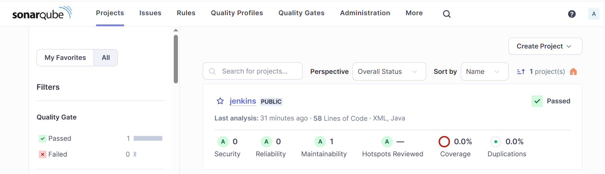
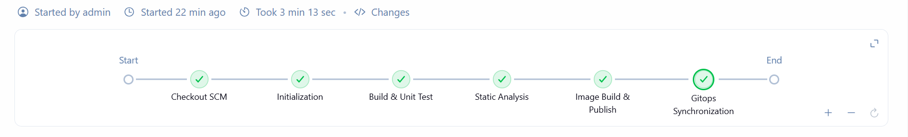
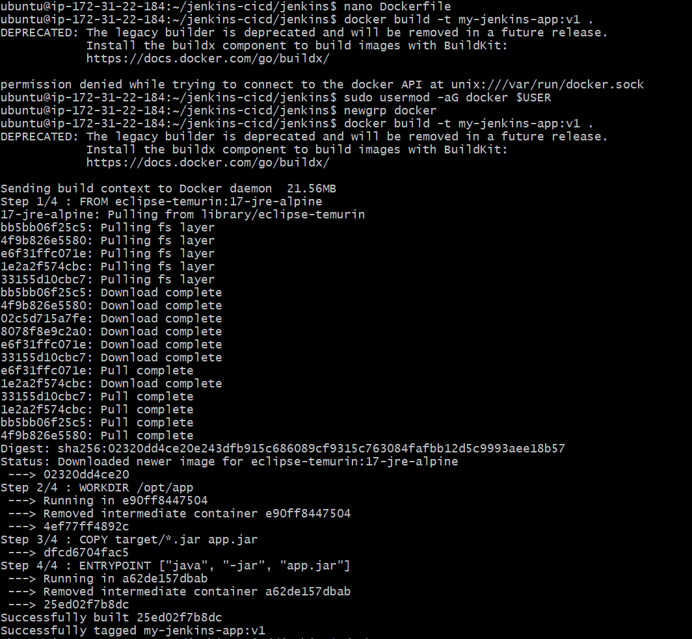
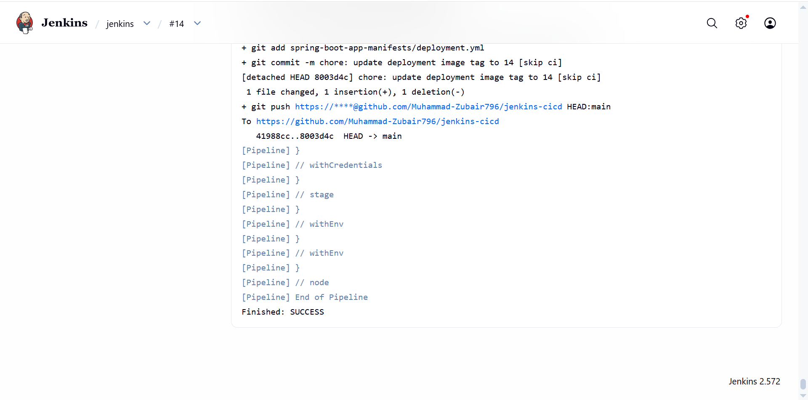
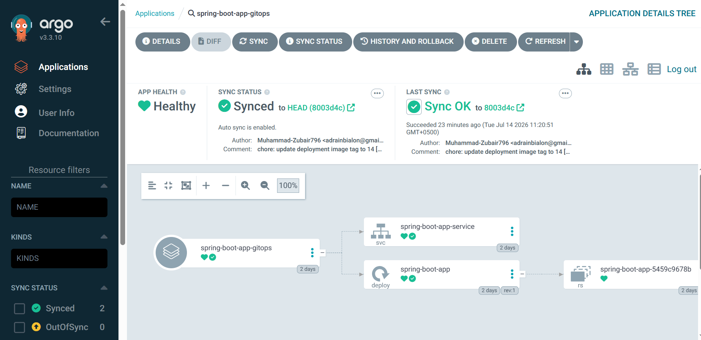
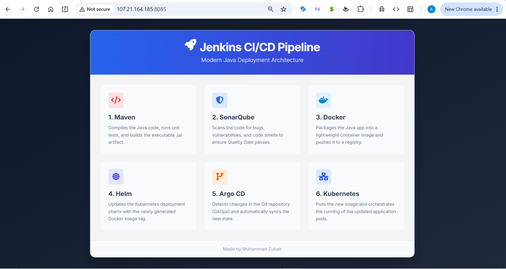

# 🚀 Enterprise DevSecOps & GitOps Pipeline Architecture

## 📌 Project Overview
This repository demonstrates a fully automated, declarative **Continuous Integration (CI)** and **Continuous Deployment (CD)** pipeline. Built on an AWS EC2 instance, the architecture leverages **Jenkins** for isolated build/test/scan stages, **SonarQube** for strict security quality gates, and **Argo CD** for declarative GitOps synchronization into a **Kubernetes** cluster.

---

## 🏗️ Architecture Flow

1. **Source Control:** Developer pushes Spring Boot Java code to GitHub.
2. **Continuous Integration (Jenkins):** 
   - Checks out the SCM.
   - Spawns an isolated Docker agent (`maven:3.9.6-eclipse-temurin-17-alpine`).
   - Compiles code and executes unit tests.
3. **Static Application Security Testing (SAST):** Jenkins triggers a SonarScanner analysis, pushing telemetry to the SonarQube server to validate Quality Gates.
4. **Artifact Packaging:** Jenkins builds the Docker image and pushes it to Docker Hub.
5. **GitOps Manifest Update:** Jenkins dynamically updates the Kubernetes `deployment.yml` with the new image tag and commits the changes back to GitHub.
6. **Continuous Deployment (Argo CD):** Argo CD detects the state drift in GitHub, pulls the updated manifests, and synchronizes the Kubernetes cluster (Minikube) to match the desired state.

---

## 🧠 Key Engineering Challenges Resolved

This pipeline was built under strict hardware constraints, requiring advanced Linux and DevOps troubleshooting:

* **Mitigated OOM (Out-Of-Memory) Starvation:** Running Jenkins, SonarQube (Elasticsearch), and Kubernetes concurrently on a 2GB AWS instance caused severe disk thrashing and API control plane timeouts. **Resolution:** Engineered a persistent 2GB kernel-level Swap file (`/etc/fstab`), permanently modified `vm.max_map_count` for Elasticsearch, and dynamically scaled down heavy OLM operators to free up API CPU cycles.
* **Java Runtime Environment Conflicts:** Jenkins v2.572 strictly requires Java 21, but the host application environment required Java 17. **Resolution:** Engineered a Systemd drop-in override (`override.conf`) to inject the Java 21 binary path strictly into the Jenkins daemon's execution context, leaving the global OS safely on Java 17.
* **Argo CD Bcrypt Authentication Lockout:** The default Kubernetes secret contained an invalid dummy bcrypt hash, locking out the Argo CD admin dashboard. **Resolution:** Utilized `htpasswd` to generate a valid bcrypt hash, patched the `argocd-secret` via `kubectl`, and forced a pod restart to reload the credentials.
* **Docker Socket Permission Denied:** Jenkins agents lacked permissions to build containers. **Resolution:** Configured Unix group memberships (`usermod -aG docker`) and refactored the Jenkinsfile to execute Docker commands directly on the host agent to prevent nested workspace lockups (Exit Code -2).

---

## 📸 Pipeline Execution & Visual Proof

### 1. Continuous Integration & Security Analysis
The pipeline initiates by compiling the Spring Boot application and running strict SAST analysis via SonarQube.

<b>View CI & SonarQube Evidence</b>

 
  
**Maven Build Success:**

**SonarQube Quality Gate Passed:**

**Jenkins Pipeline Stages:**

### 2. Containerization & GitOps Synchronization
Once the image is pushed to Docker Hub, Jenkins uses `sed` to dynamically update the Kubernetes deployment manifest and pushes the commit back to GitHub `[skip ci]`.

<b>View Docker & GitOps Evidence</b>

 

**Docker Build & Tagging:**

**Automated GitHub Commit via Jenkins:**

### 3. Continuous Deployment (Argo CD & Kubernetes)
Argo CD detects the new commit, pulls the updated `deployment.yml`, and synchronizes the Minikube cluster.

<b>View Argo CD & Kubernetes Evidence</b>

 

**Argo CD Dashboard (Healthy & Synced):**

**Argo CD Application Tree:**

---

## 🎉 Final Production Application
With the GitOps synchronization complete, the Kubernetes `NodePort` service successfully routes traffic to the newly deployed Spring Boot pods.

---

## 📂 Repository Structure

* `Jenkinsfile`: The declarative Groovy pipeline script orchestrating the CI/CD lifecycle.
* `Dockerfile`: Multi-stage containerization instructions using a lightweight Alpine JRE base image.
* `spring-boot-app-manifests/deployment.yml`: Kubernetes deployment manifest (dynamically updated by Jenkins).
* `spring-boot-app-manifests/service.yml`: Kubernetes service manifest exposing the application via NodePort.
* `app.js` & `index.html`: A custom-built, interactive frontend dashboard documenting the engineering post-mortem of this project.

---
*Designed and Engineered by [Muhammad Zubair](https://github.com/Muhammad-Zubair796)*
